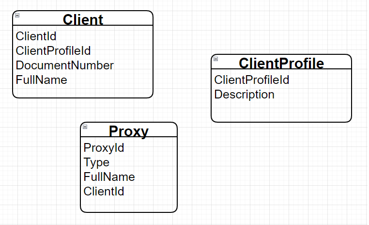
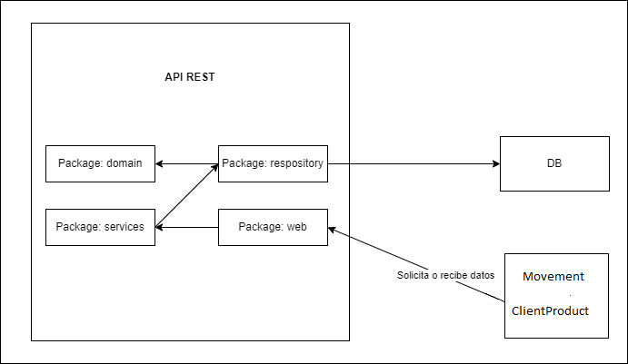
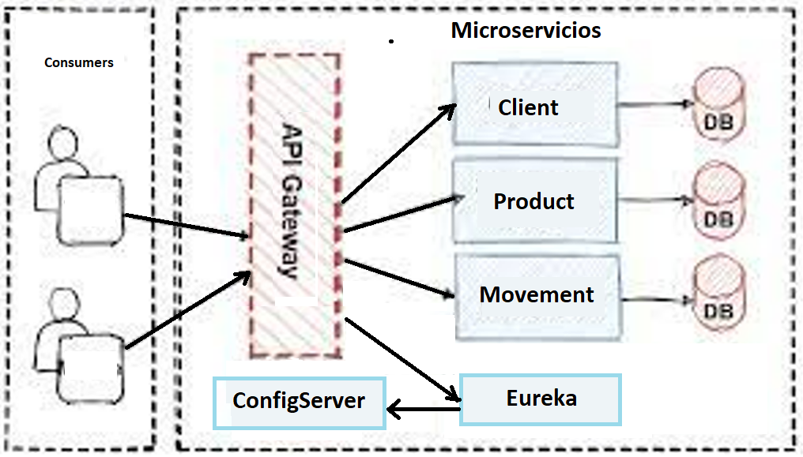
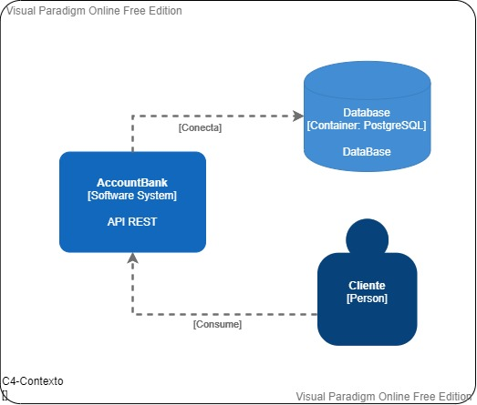
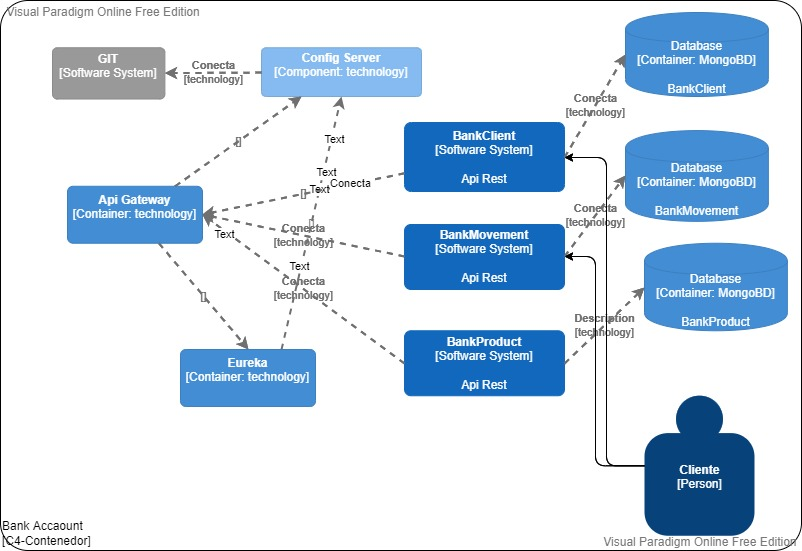

# Bank-MS

Proyecto BankAccounts

Integrantes:

- Ivan Abel Minaya De La Cruz
- Sergio Alvarez Toledo
- Héctor Walter Pretell Hinostroza
- William Felipe Martel Quiroz

Propósito del Proyecto:

- Microservicios para el manejo de las cuentas de los clientes del banco.
- El sistema está planteado en el contexto del negocio bancario que extiende las funcionalidades y requerimientos presentados en el proyecto BankAccounts.

El microservicio está basado en las transacciones de estas clases:

Además el microservicio esta agrupado según los componentes:

Los diagramas C4 desde el más concreto hasta el más detallado:

